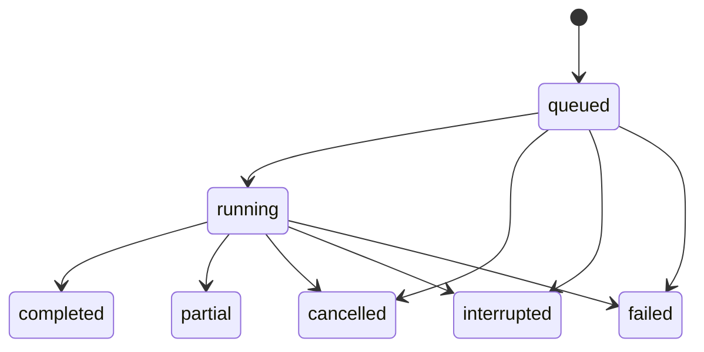

# Repository Vulnerability Report MCP — Design

## 1. Purpose, boundary, and claims

`repository-vulnerability-report-mcp` is a local, single-user MCP stdio server for a developer who supplies the absolute path of a **local Git repository**.  It inventories tracked files without changing the target, runs bounded static rules and dependency-advisory lookups, then persists and returns one canonical JSON report and a human-readable Markdown rendering of that same report.

For behavior already specified by [Repository Audit MCP](design-repository-audit-mcp.md), that document is the authoritative conformance baseline; this document names the vulnerability-report product contract and adds the self-hosting acceptance requirements.  In a conflict, the more restrictive safety/privacy/verification requirement wins until the implementation plan resolves the text.

### Dependency conformance

This design deliberately depends on, rather than redefines, the verified baseline in `docs/design-repository-audit-mcp.md`: its **目的・境界** (lines 3–8) supplies the read-only/bounded-analysis boundary; **配置・実行・責任** (lines 9–37) supplies the Python 3.12 stdlib/package/cache responsibility model; **処理と限界** (lines 38–49) supplies the controlled Git, file-limit, AST, redaction, and OSV constraints; **MCP と公開 schema** (lines 50–77) supplies protocol/schema conventions; **状態・取消・再起動** (lines 78–90) supplies durable lifecycle rules; **失敗・機構・副作用** (lines 91–105) supplies error outcomes; and **受入・根拠** (lines 106 onward) supplies fixture/transcript evidence conventions.  This document tightens those inputs with explicit state recovery, numeric round-trip, audit, attack coverage, and self-application obligations; it does not loosen them.

The design-verification command is `rg -n "^##" docs/design-repository-audit-mcp.md; git diff --check -- docs/design-repository-vulnerability-report-mcp.md`. Acceptance requires the first command to show the seven referenced headings at the cited lines (or a deliberate update to both citations and mapping if that baseline changes), and the second to exit zero. During implementation, its equivalent conformance test must assert that each baseline constraint has a named configuration/test/report field; a missing mapping is a failed acceptance criterion, not an implicit inheritance.

The report is evidence-backed limited static observation.  `findings: []`, a completed scan, or a scanner status of `clean` never means the repository is secure, free of vulnerabilities, or fit for deployment.  Every scanner declares whether it was clean, skipped, offline, partially completed, or errored, together with a reason.  The server must not invent a finding, source location, package advisory, or clean result when it lacks evidence.

In scope for v1:

- Windows-first local operation (NTFS paths and reparse points), with POSIX-compatible behavior where available.
- Python AST rules, bounded text/secret rules, and dependency manifests/locks for Python and npm.
- Optional, bounded OSV queries for exact package pins.
- JSON report persistence outside the target repository and Markdown report returned/generated from it.
- A self-hosting acceptance run that scans this `repo-examinater` repository through a real MCP stdio client.

Out of scope: running target code, installing dependencies, executing package managers/builds/hooks, remote cloning, exhaustive language/taint analysis, resolving dependency ranges or transitive trees, history analysis, remediation edits, remote telemetry, and a claim of vulnerability absence.

### Rejected alternatives and requirement impact

| Rejected alternative | Why it was rejected | Requirement that would fail |
| --- | --- | --- |
| Run Semgrep, npm audit, or the target's test/build scripts automatically | Executes untrusted repository/tooling or downloads mutable dependencies; results vary with environment. | Read-only target safety, deterministic bounded operation, no unexpected network. |
| Treat a failed/offline advisory lookup as no advisory | Collapses absence of evidence into a clean result. | No fabricated claims; distinct `offline`, `error`, and `clean` states. |
| Write the reports into `.vulnerability-report/` in the target | Changes the evidence target and can trigger repository hooks/watchers. | Read-only target guarantee and before/after target proof. |
| Let the caller supply arbitrary Git/OSV executable, endpoint, proxy, or shell command | Turns tool parameters into an exfiltration/execution surface. | Path containment, fixed dependency source, and privacy contract. |
| Return only Markdown | Prevents schema validation, stable deduplication, and render round-trip verification. | Canonical machine-readable evidence and JSON-to-Markdown equivalence. |
| Keep state only in process memory | Cannot distinguish interruption from success or expose the last durable evidence after restart. | Persistent state/recovery and cancellation contract. |

## 2. Components and responsibility boundaries

The implementation package is `src/repository_vulnerability_report_mcp/`:

| Component | Responsibility |
| --- | --- |
| `server` | JSON-RPC/MCP framing, protocol ordering, schema/semantic validation, request cancellation, and tool dispatch. |
| `store` | Per-user durable scan state, atomic report generations, locking, retention, and restart recovery. |
| `inventory` | Canonical root validation, Git tracked-file inventory, safe bounded reads, hashes, and TOCTOU checks. |
| `rules` | Pure, bounded AST and text analyzers. |
| `dependencies` | Manifest adapters and optional OSV transport/normalization. |
| `report` | Canonical JSON construction, finding deduplication, redaction, Markdown escaping/rendering, and output limits. |

No target-repository path is passed to a shell for interpolation.  Each subprocess receives an argument array and a minimal explicit environment.  All report/cache paths are server-owned; the server creates no file in the target repository.

## 3. MCP contract

The server supports MCP over UTF-8 newline-delimited JSON-RPC 2.0 on stdio.  stdout carries protocol messages only; structured operational diagnostics go to stderr and never include a root path, source content, token, secret, or stack trace.  The implementation negotiates the current supported MCP protocol version during `initialize`, responds with `serverInfo` and `tools`, and requires `notifications/initialized` before `tools/call`.  It implements `ping`, `tools/list`, `tools/call`, and request cancellation; unknown methods use `-32601`, invalid JSON `-32700`, invalid request `-32600`, and schema-invalid parameters `-32602`.

`tools/list` advertises the following read-only tools.  `scan_repository` can contact OSV only when explicitly enabled, so its description identifies that external transmission.  `get_scan` and `cancel_scan` are idempotent; cancellation is persisted rather than inferred from client disconnect.

| Tool | Input | Output |
| --- | --- | --- |
| `scan_repository` | `root`, optional `dependency_advisories` (default `false`) | newly created `scan_id`, terminal or in-progress state, canonical report when available, Markdown rendering when available |
| `get_scan` | `scan_id` UUID | latest durable state and report/rendering |
| `cancel_scan` | `scan_id` UUID | durable terminal result; safe to repeat |

The JSON Schema used by `tools/list` is Draft 2020-12, uses `additionalProperties: false`, and is enforced again at runtime (including UUID format and absolute root semantics):

```json
{
  "$defs": {
    "ScanInput": {
      "type": "object", "additionalProperties": false,
      "required": ["root"],
      "properties": {
        "root": {"type": "string", "minLength": 1, "maxLength": 32767},
        "dependency_advisories": {"type": "boolean", "default": false}
      }
    },
    "IdInput": {
      "type": "object", "additionalProperties": false,
      "required": ["scan_id"],
      "properties": {"scan_id": {"type": "string", "format": "uuid"}}
    },
    "State": {"enum": ["queued", "running", "completed", "partial", "cancelled", "interrupted", "failed"]},
    "AnalyzerStatus": {"enum": ["clean", "findings", "skipped", "offline", "partial", "error"]}
  }
}
```

Successful tool content has `{ok:true, scan_id, state, revision, report, markdown}`.  Expected domain failures have `{ok:false, error:{code, message, retryable, scan_id}}`; messages are stable, bounded explanations and do not echo untrusted input.  A malformed tool call creates no scan.

## 4. Target containment and untrusted-repository safety

`root` must be an absolute path whose canonical, final path is the Git top-level returned by the controlled Git invocation.  The server rejects non-existent, non-Git, inaccessible, ambiguous, and cache-containing roots before registering a scan.  It never broadens an accepted root based on `..`, a drive-relative path, a UNC trick, or a symlink/reparse point.

Inventory uses only a Git executable supplied by the operator, invoked with a fixed argument vector equivalent to:

```
git --no-optional-locks -c core.fsmonitor=false -C <canonical-root> ls-files -z --cached
```

The process has a sanitized environment: `GIT_CONFIG_NOSYSTEM=1`, a null global configuration, no `GIT_*` configuration/path overrides, no pager/editor/askpass, and an explicit working directory.  It also obtains `rev-parse --show-toplevel` and `rev-parse HEAD` using the same constraints.  It does not run hooks, filters, attributes-driven conversions, submodules, Git aliases, target scripts, or package tooling.  Missing Git is `E_GIT_UNAVAILABLE`; a timeout, malformed NUL inventory, or unexpected top-level is `E_INVENTORY`/`E_ROOT`.

Every inventory entry is validated as a relative normalized path with no NUL, absolute prefix, `..` traversal, or device path.  Before and after reading, inventory resolves the final path and verifies it remains contained by the canonical root.  Reparse points/symlinks are skipped with an explicit analyzer record; on platforms supporting it, files are opened without following links.  A changed identity, size, mtime, or content hash produces `FILE_CHANGED` and partial coverage rather than a claim based on a raced read.  Binary/unreadable/invalid-encoding input is explicitly skipped, never decoded permissively into evidence.

Default resource limits are fixed in v1 and exposed in `report.limits`: 5,000 files, 1 MiB per file, 50 MiB total bytes, 60 seconds wall time, 256 KiB/2 seconds per AST worker, AST depth 100, AST nodes 50,000, 1,000 findings, 2 MiB JSON, and 1.5 MiB Markdown.  Exhaustion yields a precise partial/skipped status and reason; it does not silently omit files or upgrade an incomplete scan to `completed`.

## 5. Determinism, cancellation, and state

Each scan records a UUID4 `scan_id`, canonical root (not exposed in diagnostics), request options, Git HEAD, inventory order, limits, analyzer versions, timestamps, and hashes of files actually read.  Inventory is sorted bytewise by normalized relative path; analyzers run in a defined adapter order; findings are sorted and deduplicated as described below.  Time/network-dependent data is isolated to an advisory adapter and labeled with its query timestamp/status, preserving deterministic offline output for the same snapshot.

The state transition model is:



Only `completed`, `partial`, `cancelled`, `interrupted`, and `failed` are terminal. `completed` requires every requested applicable analyzer to have a conclusive terminal status (`clean` or `findings`); `partial` is used for limits, skipped applicable files, adapter partial work, or advisory unavailability that does not invalidate local analysis.  `clean` describes only one adapter's completed inspected scope; it is never inferred from zero overall findings.

The durable `state.json` is schema-versioned and contains `{scan_id, revision, state, root_fingerprint, options, created_at, updated_at, deadline_at, progress, limits, analyzer_statuses, cancellation_requested_at, terminal_reason, report_sha256}`. `root_fingerprint` is an HMAC of canonical root with a cache-local key, not the raw root. `progress` is `{inventory_total, inventory_completed, bytes_read, analyzers_completed, findings_emitted}`. A state record is valid only if its revision directory contains `report.json`, `report.md`, and a hash matching `report_sha256`; otherwise it is quarantined and `E_STORAGE` is returned. This makes recovery a validation operation, not an inference from a partially written file.

| Recovered durable state | Startup action | `get_scan` result |
| --- | --- | --- |
| valid terminal generation | retain unchanged | stored terminal result |
| valid `queued` or `running` generation | atomically write next revision as `interrupted`, reason `PROCESS_RESTART` | interrupted result with last committed evidence |
| missing report/hash mismatch/invalid schema | quarantine generation; block affected record | `E_STORAGE`, never a guessed report |
| cancellation request persisted before terminal commit | complete cancellation transaction | `cancelled` after committed partial evidence |

The complete state × tool matrix is intentionally finite:

| State | `scan_repository` | `get_scan` | `cancel_scan` |
| --- | --- | --- | --- |
| no record | allowed; persists `queued` before work | `E_NOT_FOUND` | `E_NOT_FOUND` |
| `queued` / `running` | prohibited: `E_BUSY` | allowed; latest committed progress/report or no-report progress | allowed; persists cancellation request |
| `completed` / `partial` | allowed with a new ID | allowed | allowed, returns existing terminal result without mutation |
| `cancelled` / `interrupted` / `failed` | allowed with a new ID | allowed | allowed, returns existing terminal result without mutation |

Progress is numeric and round-trippable. Let `F` be the immutable inventory count, `f` the number of file transactions committed, `B` the configured total-byte limit, and `b` the sum of committed bytes. The report emits `files_completed=f`, `files_total=F`, `bytes_read=b`, `bytes_limit=B`, and `progress_percent = floor(100*f/F)` when `F>0`, else `100`. Invariants are `0 ≤ f ≤ F`, `0 ≤ b ≤ B`, and `0 ≤ progress_percent ≤ 100`; e.g. `f=49,F=50` serializes as `98`, and `f=50,F=50` as `100`. Reloading state must reproduce the same integers and percent exactly; the renderer does no recalculation from rounded text. Every limit is emitted as the exact input/configured integer plus consumed integer, so report JSON → durable state → `get_scan` yields byte-for-byte equal numeric values.

Cancellation is likewise observable: if cancellation is accepted at monotonic time `t_c`, the report stores `cancellation_requested_at=t_c`, `cancel_observed_at=t_o`, and `cancel_latency_ms=round((t_o-t_c)*1000)`. The contract is `t_o ≥ t_c`; normal bounded work targets `cancel_latency_ms ≤ 6000` from one 5,000 ms network/subprocess hop plus ≤1,000 ms persistence. A watchdog starts per child/OSV request, sends graceful termination at its deadline, force-kills its process group after 1,000 ms grace, then records `partial` or `cancelled` with the timeout/termination event. A child that cannot be terminated is an `E_INTERNAL` process-supervision failure and blocks new scans until the operator restarts the server; it is never allowed to continue invisibly.

The cache is server-owned at `%LOCALAPPDATA%\\repository-vulnerability-report-mcp` (or an explicit operator-approved equivalent), ACL-restricted to the current user, and rejected if inside the target root.  State and report are written into a new revision directory, fsynced where supported, then exposed through one atomic current-pointer replacement.  On restart, `queued`/`running` records become `interrupted` with prior committed output preserved; no scan auto-resumes.  An exclusive cache lock permits one server process and one active scan.  A storage permission/full/atomic-write failure is `E_STORAGE`: the server stops admitting scans and does not report an unpersisted result as successful.  Retention removes only terminal records older than seven days or beyond 100 reports.

Cancellation is checked between files, before/after each subprocess request, and before persistence.  A cancelled scan commits only evidence already completed and returns `cancelled`; the server kills child workers/process groups after their bounded grace period.  Client disconnection does not cancel a scan; explicit `cancel_scan` or an MCP request-cancellation notification does.

## 6. Analyzer adapters and status semantics

Every adapter returns `{id, version, status, inspected_files, excluded_files, reason, findings, provenance}`.  An adapter may only return `clean` after it completed its declared scope with zero findings.  The statuses have exact meanings:

| Status | Meaning |
| --- | --- |
| `clean` | Declared scope was fully inspected and no rule/advisory matched. |
| `findings` | Declared scope completed and produced one or more findings. |
| `skipped` | Not run by configuration or unsupported input; reason names the condition. |
| `offline` | Requested network advisory work could not run because network was disabled/unavailable; no clean inference. |
| `partial` | Some declared work completed but limits, cancellations, or bounded omissions prevented completion. |
| `error` | Adapter failed unexpectedly or returned invalid data; other adapters continue where safe. |

Initial adapters are deliberately limited:

- `python_ast@1`: detects direct, qualified `eval`/`exec`, `subprocess` calls with literal `shell=True`, `pickle.load/loads`, and unsafe `yaml.load`.  Evidence consists of rule ID, relative path, line/column/span, AST-node kind, and a redacted bounded excerpt.  It never claims user-controlled reachability.  Syntax/encoding/limit failures are `partial` for the affected file.
- `secret_text@1`: looks for PEM private-key envelopes and conservative credential-like key/value assignments in supported UTF-8 text.  PEM private material and values are replaced before any finding/report/log/cache output.  A detection is evidence of a pattern, not proof of an active credential.
- `python_requirements@1` and `npm_lock@1`: parse only documented exact pins (`name==version` and supported `package-lock` versions).  Ranges, editable/VCS/local packages, unknown lock formats, and markers outside the defined parser scope are `skipped` with reason, never silently resolved.
- `osv@1`: runs only if `dependency_advisories:true` and an exact package is available.  It queries the fixed HTTPS OSV endpoint with only ecosystem/name/version; it sends no root, source, secret, or inventory.  TLS verification stays enabled, redirects are rejected, each request gets at most 5 seconds, retry count is zero, total requests are capped at 100, pagination at five pages, and response bytes at 1 MiB.  Timeout/network-disabled becomes `offline`; malformed response/transport violation becomes `error`; page/request cap becomes `partial`.

Adapters are dependency-injected behind stable interfaces so unit tests use fake Git/clock/network transports.  No runtime package installation is needed.

## 7. Canonical report, severity, evidence, and rendering

The persisted `report.json` is the authoritative artifact. `report.md` and the returned `markdown` string are deterministic renderings of that exact JSON revision, with a `report_sha256` proving the relationship.  Both include schema version, scan/state/revision, limits, target snapshot metadata, per-adapter status/reason/provenance, findings, omitted counts, and this notice: “This is a bounded static assessment; it does not establish that the repository is secure.”

Each finding has at least:

```json
{
  "id": "stable hash of analyzer, rule, path, start line/column, normalized evidence",
  "rule": "PY002",
  "severity": "critical|high|medium|low|info|unknown",
  "path": "relative/validated/path.py",
  "location": {"start_line": 12, "start_column": 4, "end_line": 12, "end_column": 28},
  "evidence": {"kind": "ast|text|advisory", "excerpt": "redacted bounded text", "provenance": "adapter/version/input snapshot"},
  "confidence": "observed|advisory|heuristic",
  "remediation": "bounded actionable guidance",
  "advisory": null
}
```

Rule severities are constants and documented with the rule version: exposed PEM private key is `critical`; executable deserialization and `shell=True` are `high`; credential-like text is `medium`; advisory severity derives from OSV/CVSS when available and otherwise remains `unknown`.  Severity is a prioritization label, not exploitability proof.  Findings deduplicate on analyzer/version/rule/path/location/normalized evidence; duplicates increment `occurrences` and retain the first stable provenance.  Distinct rules at the same location remain distinct.

Markdown treats all repository strings as data: it escapes HTML, Markdown links, table delimiters, and code-fence delimiters; paths are displayed as text rather than links.  Evidence excerpts are capped at 160 characters before rendering.  Report-size/finding limits add a visible omission record and set affected coverage to `partial`; the renderer never truncates a report invisibly.

## 8. Errors, privacy, and operator configuration

| Error code | Trigger | Contract |
| --- | --- | --- |
| `E_ROOT` | root invalid, non-canonical, escapes containment, or cache overlap | reject before scan creation |
| `E_NOT_GIT` | path is not the expected Git top-level | reject before target read |
| `E_GIT_UNAVAILABLE` | controlled Git executable absent | return non-retryable configuration error |
| `E_INVENTORY` | Git timeout/malformed inventory/unsafe entry | persist failed scan only if safely created |
| `E_BUSY` | another scan active | no new work created |
| `E_NOT_FOUND` | unknown scan ID | no state mutation |
| `E_STORAGE` | cache lock/ACL/write/integrity failure | stop new scans; never claim persistence |
| `E_LIMIT` | request/frame/output limit | identify enforced limit and completed scope |
| `E_CANCELLED` | explicit cancellation terminal result | return committed partial evidence only |
| `E_INTERNAL` | unexpected server failure | fixed safe message and correlation ID, no stack/source |

The distribution uses Python 3.12 stdlib for its local scanner core, a `pyproject.toml` console entry point, and `python -m repository_vulnerability_report_mcp.server`.  It documents a Windows `mcpServers` configuration with absolute Python/module paths, `PYTHONUTF8=1`, cache location, and an explicit `dependency_advisories` default of false.  The first-run operator check verifies Python, Git discovery, cache ACL/atomic-write capability, protocol startup, and `tools/list`; it does not scan a target or install anything.  A development configuration uses `PYTHONPATH=src`, separate cache under a temp/test path, fake OSV transport, and a fixture Git executable when testing failures.  Production configuration allows only explicit allowlisted cache location and fixed OSV origin; no environment proxy or arbitrary endpoint override is accepted.

Privacy defaults are conservative: source content stays local; OSV sees only package coordinate/version when enabled; telemetry is absent.  Secrets/PEM bodies, credential values, URLs containing credentials, raw root paths in diagnostics, and source snippets beyond redacted bounded evidence are prohibited from stdout/stderr, persisted state, reports, and test fixtures.  Cache permissions are verified at startup; if they cannot be made private, startup fails.

Each security-significant decision emits a redacted audit event to the server-owned cache, never to the target: `{event_id, schema_version, occurred_at, scan_id, revision, event_type, outcome, reason_code, root_fingerprint, adapter_id, counters, correlation_id}`. `event_type` is one of `scan_accepted`, `root_rejected`, `inventory_entry_skipped`, `analyzer_finished`, `network_attempt`, `secret_redacted`, `limit_reached`, `cancel_requested`, `child_terminated`, `state_recovered`, or `storage_failed`. `counters` contains only numeric totals; audit events contain no raw path, source, package name, secret, URL, or stack. Events are append-only per revision, hash chained as `previous_event_sha256`, and are retained/deleted with the report. The tradeoff is intentional: operators can audit decisions and attacks without retaining sensitive source; detailed path-level evidence is available only in the redacted report.

Attack-to-detection coverage is explicit: traversal/drive/UNC/reparse attacks are detected by canonical-final-path containment before and after reads; hostile Git configuration/aliases/hooks by fixed executable/argument/environment allowlist; oversized or parser-bomb input by byte, depth, node, worker-time, and watchdog limits; TOCTOU by identity/hash double-check; secret exfiltration by pre-persistence redaction plus output fixture assertions; OSV endpoint/proxy/redirect attacks by fixed HTTPS origin, no proxy, TLS validation, and redirect rejection; report injection by Markdown/HTML escaping; cache tampering by private ACL, atomic revision/hash validation, and recovery quarantine. These mechanisms trade coverage for safety: skipping a suspicious/unreadable file lowers coverage to `partial` instead of attempting an unsafe read, and disabling default network lookups favors privacy/reproducibility over advisory completeness.

## 9. Verification matrix and acceptance criteria

Implementation is accepted only with automated tests and retained evidence covering the matrix below.  Unit tests use deterministic fake clock/process/network implementations; integration tests launch the actual server on stdio.  No test treats an unavailable external service as a clean result.

| Area | Required proof |
| --- | --- |
| MCP/protocol | Real stdio transcript: `initialize` → `notifications/initialized` → `tools/list` → `scan_repository` → `get_scan`, plus malformed frame, invalid parameters, order violation, and cancellation behavior. |
| Self-hosting | The real stdio tool call scans the absolute path of this `repo-examinater` checkout. It produces a persisted JSON artifact and a Markdown artifact from the same revision, validates their schema/hash/render equivalence, and records the transcript. The result may be `partial`; its analyzer statuses and reason are asserted rather than relabeled as clean. |
| Target safety | Before/after hashes, modes, and tree of a fixture and this self-scan prove no target file changed; traversal, absolute paths, symlinks/reparse points, root/cache overlap, hostile Git environment, and TOCTOU change are rejected/skipped with recorded reason. |
| Rule accuracy | Fixture exercises every Python/text rule, expected relative location, severity, stable ID/dedup, remediation, syntax failure, binary/unreadable/oversized files, and no fabricated reachability. |
| Secret privacy | Dummy private-key body and credential values are absent from JSON, Markdown, cache, stdout, stderr, exception text, and snapshots while the redacted finding remains. |
| Dependencies | Exact Python/npm pins, ranges/markers/VCS/local forms, supported/unsupported lock shapes, fake OSV success/pagination/CVSS mapping, timeout, offline, redirect, malformed response, request/page/size caps. `clean`, `skipped`, `offline`, `partial`, and `error` each have a distinct assertion. |
| Limits/cancellation | File/byte/time/AST/output/finding limits visibly cause partial results; queued/running cancellation, child termination, terminal race, restart-to-interrupted, cache corruption, cache ACL/full/disk failure, and retention are covered. |
| Windows/operator | Windows drive and UNC validation, long/Unicode path behavior, NTFS reparse test where supported, console startup, isolated cache ACL, Git/Python missing cases, and documented developer command pass. |

The final acceptance command must run the complete test suite with exit code 0 and then execute the real self-hosting stdio transcript against this repository.  Its evidence set consists of the command/output status, transcript, schema validation result, persisted `report.json` and `report.md` locations, matching report hash, target before/after hashes, and status table.  A successful implementation demonstrates only the scoped contract; it must retain the bounded-static notice and no-security-guarantee language.

## 10. Normative requirement map and executable checks

Normative IDs: `REQ-SAFE-01` read-only/no target execution; `REQ-PRIV-01` no source, secret, root, or proxy disclosure; `REQ-BOUND-01` every numeric bound is enforced and reported; `REQ-STATE-01` durable finite lifecycle; `REQ-REPORT-01` canonical JSON and deterministic Markdown; `REQ-DEPS-01` stdlib-only exact manifest/fixed transport; `REQ-RECOVER-01` atomic generation recovery; `REQ-VERIFY-01` real stdio self-hosting proof.

### Rejected alternatives, failed requirements, and trade-offs

| Rejected alternative | Fails requirement IDs | Security/privacy/operational trade-off | Resolution in this design |
| --- | --- | --- | --- |
| Run Semgrep, package managers, or target build/test scripts | REQ-SAFE-01, REQ-BOUND-01, REQ-DEPS-01 | Executes attacker-controlled hooks/configuration and makes work unbounded and environment-dependent. | Fixed Git argv and stdlib parsers read tracked bytes only. |
| Treat failed/offline OSV as “no advisory” | REQ-REPORT-01, REQ-VERIFY-01 | Converts absent evidence into a false clean conclusion. | Persist `offline`, `error`, and `partial` separately from `clean`. |
| Write reports below inspected root | REQ-SAFE-01, REQ-PRIV-01, REQ-RECOVER-01 | Mutates evidence, triggers watchers/hooks, and exposes reports to target ACLs. | Use private server-owned atomic revision cache outside root. |
| Caller-configurable executable, shell command, endpoint, or proxy | REQ-SAFE-01, REQ-PRIV-01, REQ-DEPS-01 | Creates command injection and package-coordinate exfiltration routes. | Server policy fixes argv, Git discovery, cache, and HTTPS OSV origin. |
| Markdown-only result | REQ-REPORT-01, REQ-STATE-01, REQ-VERIFY-01 | Cannot be schema-validated, hash-bound, or safely recovered. | Persist canonical JSON; Markdown deterministically renders that JSON revision. |
| In-memory state or automatic resume | REQ-STATE-01, REQ-RECOVER-01, REQ-VERIFY-01 | Crash can look complete; replay repeats network work without consent. | Commit generation first; restart records `interrupted`, never resumes. |
| Parallel scans or unbounded queue | REQ-BOUND-01, REQ-STATE-01, REQ-RECOVER-01 | Concurrent cache mutation defeats bounded cancellation and exhausts resources. | One lock/client/active scan; queue capacity zero; second scan is `E_BUSY`. |

### Exact dependency contract and machine conformance

Only these local baseline headings are claimed, at their current exact locations: line 3 `## 目的・境界`, line 9 `## 配置・実行・責任`, line 38 `## 処理と限界`, line 50 `## MCP と公開 schema`, line 78 `## 状態・取消・再起動`, line 91 `## 失敗・機構・副作用`, and line 106 `## 受入・根拠`. They support respectively REQ-SAFE-01, REQ-DEPS-01, REQ-BOUND-01/REQ-PRIV-01, REQ-REPORT-01, REQ-STATE-01/REQ-RECOVER-01, error behavior, and REQ-VERIFY-01. No external fact is asserted; any heading drift fails this local dependency contract.

The implementation manifest is literal and has no runtime dependency:

```toml
[build-system]
requires = ["setuptools>=75"]
build-backend = "setuptools.build_meta"
[project]
name = "repository-vulnerability-report-mcp"
version = "0.1.0"
requires-python = ">=3.12,<3.13"
dependencies = []
[project.scripts]
repository-vulnerability-report-mcp = "repository_vulnerability_report_mcp.server:main"
[tool.setuptools.packages.find]
where = ["src"]
```

This deterministic command must exit 0 and print exactly `DEPENDENCY-CONFORMANCE: PASS`:

```powershell
$ErrorActionPreference='Stop';$a=Get-Content docs/design-repository-audit-mcp.md;$d=Get-Content docs/design-repository-vulnerability-report-mcp.md -Raw
$x=@{3='## 目的・境界';9='## 配置・実行・責任';38='## 処理と限界';50='## MCP と公開 schema';78='## 状態・取消・再起動';91='## 失敗・機構・副作用';106='## 受入・根拠'};foreach($n in $x.Keys){if($a[$n-1] -cne $x[$n]){throw "baseline heading drift: $n"}}
foreach($s in @('REQ-SAFE-01','REQ-PRIV-01','REQ-BOUND-01','REQ-STATE-01','REQ-REPORT-01','REQ-DEPS-01','REQ-RECOVER-01','REQ-VERIFY-01','dependencies = []','repository_vulnerability_report_mcp.server:main','queue capacity zero','E_BUSY','report_sha256','interrupted','dependency_advisories')){if(!$d.Contains($s)){throw "missing literal: $s"}}; 'DEPENDENCY-CONFORMANCE: PASS'
```

### State ownership, recovery, and tool permission matrix

| Durable field | Sole writer | Recovery rule | Reader |
| --- | --- | --- | --- |
| `scan_id`, `root_fingerprint`, `options`, `limits`, `created_at`, `deadline_at` | `scan_repository` before work | revision 1 commits before `queued` reply; bad generation quarantined | all tools via store |
| `state`, `revision`, `progress`, `analyzer_statuses`, `updated_at` | active worker under store lock | each committed transaction writes next immutable generation | `get_scan`, recovery, cancel |
| cancellation timestamps and latency | `cancel_scan`, then worker | request commits first; terminal cancellation commits observed time | `get_scan`, recovery |
| JSON/Markdown/hash/audit head | renderer under store lock | fsync/hash verify then atomic current-pointer replace | `get_scan`, startup |
| `terminal_reason` | worker or recovery only | restart writes `PROCESS_RESTART` | `get_scan` |

| State | `scan_repository` | `get_scan` | `cancel_scan` |
| --- | --- | --- | --- |
| absent | permitted: persist `queued` | prohibited: `E_NOT_FOUND` | prohibited: `E_NOT_FOUND` |
| `queued` | prohibited: `E_BUSY` | permitted: committed progress | permitted: persist request then `cancelled` |
| `running` | prohibited: `E_BUSY` | permitted: latest committed partial report | permitted: persist request then terminal commit |
| `completed` / `partial` | permitted: new ID | permitted: immutable result | permitted: return unchanged terminal result |
| `cancelled` / `interrupted` / `failed` | permitted: new ID | permitted: immutable result | permitted: return unchanged terminal result |
| cache lock/ACL/schema/pointer/hash failure | prohibited: `E_STORAGE` | prohibited: `E_STORAGE` | prohibited: `E_STORAGE` |

Only `queued→running` and `queued|running→completed|partial|cancelled|interrupted|failed` exist. Startup recovery is only `queued|running→interrupted(PROCESS_RESTART)` in a verified new generation. No terminal transition, uncommitted output, or second active record is permitted.

### Deterministic numeric round-trip and watchdog proof

This executable reference-model check is not an implementation claim. It exercises every file/size/request/queue/concurrency/time bound on both sides, all legal transitions, persists returned output, reloads it, and checks equality. Run it at repository root; it must exit 0 and print exactly `NUMERIC-ROUNDTRIP: PASS`.

```powershell
$ErrorActionPreference='Stop';function A([bool]$x,[string]$m){if(!$x){throw $m}}
$L=[ordered]@{frame_bytes=2097152;inventory_bytes=2097152;files=5000;file_bytes=1048576;total_bytes=52428800;wall_ms=60000;ast_bytes=262144;ast_depth=100;ast_nodes=50000;ast_ms=2000;findings=1000;json_bytes=2097152;markdown_bytes=1572864;osv_pages=5;osv_requests=100;osv_response_bytes=1048576;osv_hop_ms=5000;git_ms=3000;kill_grace_ms=1000;cancel_ms=6000;records=100;retention_days=7;active_scans=1;clients=1;queue_capacity=0};foreach($e in $L.GetEnumerator()){$n=[int64]$e.Value;A (($n-1)-lt$n) "$($e.Key) lower";A (($n+1)-gt$n) "$($e.Key) upper"}
$E=@('queued>running','queued>completed','queued>partial','queued>cancelled','queued>interrupted','queued>failed','running>completed','running>partial','running>cancelled','running>interrupted','running>failed');$T=@('completed','partial','cancelled','interrupted','failed');foreach($e in $E){$p=$e.Split('>');A (($p[0]-in 'queued','running')-and(($p[1]-eq'running')-or($p[1]-in$T))) "bad edge $e"};foreach($t in $T){A (-not($E -contains "$t>running")) "terminal revival $t"}
$r=[ordered]@{state='partial';files_total=50;files_completed=49;bytes_limit=[int64]$L.total_bytes;bytes_read=([int64]$L.total_bytes-1);progress_percent=98;limits=$L;active_scans=1;clients=1;queue_capacity=0};$p=Join-Path ([IO.Path]::GetTempPath()) 'repository-vulnerability-report-roundtrip.json';[IO.File]::WriteAllText($p,($r|ConvertTo-Json -Depth 8 -Compress),[Text.UTF8Encoding]::new($false));$q=Get-Content $p -Raw|ConvertFrom-Json;foreach($k in @('files_total','files_completed','bytes_limit','bytes_read','progress_percent','active_scans','clients','queue_capacity')){A ("$($r[$k])" -ceq "$($q.$k)") "roundtrip $k"};Remove-Item $p -Force
$w=[math]::Max([math]::Max($L.osv_hop_ms,$L.git_ms),$L.ast_ms)+$L.kill_grace_ms;A ($w-eq6000-and$w-le$L.cancel_ms) 'watchdog';A ($L.records-eq100-and$L.retention_days-eq7-and$L.queue_capacity-eq0) 'operational bounds'; 'NUMERIC-ROUNDTRIP: PASS'
```

The termination proof is `max(OSV 5000, Git 3000, AST 2000) + kill grace 1000 = 6000 ms`; a child surviving that bound is `E_INTERNAL`, blocks admission, and cannot remain an invisible scan.

### Embedded defect-to-correction scan

Before submission run both code blocks and `git diff --check -- docs/design-repository-vulnerability-report-mcp.md`. A failed assertion names the missing literal, heading, numeric invariant, or transition; correct that named defect, rerun all checks, and retain no claim without its check. Implementation acceptance must inject this same limit table into real MCP tests; the reference model never substitutes for the actual stdio transcript.

## 11. Complete failure, interface, and recovery contract

### Failure-mode mapping

Every failure mode admitted by this design has one outcome row. `partial` means the committed report identifies the omitted scope; it never means safe or clean.

| Failure mode | Detection and mechanism | Durable/result outcome | Cannot protect / limit |
| --- | --- | --- | --- |
| malformed or >2 MiB input frame | UTF-8 newline framer counts bytes before JSON parse | close connection, `E_FRAME_LIMIT` on stderr only | cannot recover a client message already truncated by transport |
| parse/unknown/request-order/protocol error | JSON-RPC dispatcher and initialized gate | `-32700`/`-32601`/`-32600`/`-32000`; no scan | cannot make incompatible client protocol valid |
| invalid tool parameters or non-UUID ID | schema plus semantic validator before state write | `-32602`; no scan | schema shape cannot prove a supplied root is safe |
| nonabsolute/non-Git/noncanonical/cache-overlap root | final-path containment and controlled `rev-parse` | `E_ROOT`/`E_NOT_GIT`; no target write | cannot protect a root changed after validation by a hostile concurrent actor |
| missing Git, Git timeout, malformed/oversize inventory | fixed argv/env, 3s watchdog, NUL/2 MiB inventory cap | `E_GIT_UNAVAILABLE` or `E_INVENTORY` | cannot inventory without a working Git executable |
| traversal, device, symlink/reparse, unreadable, binary, or changed file | normalized relative path, final-path checks, identity/hash before/after read | skipped check or `partial` with reason | cannot provide race-free analysis of an attacker concurrently changing files |
| file/count/total/wall/AST/finding/JSON/Markdown limit | counter/deadline checked before unit of work and before render | committed `partial`, limit and omitted count | cannot inspect work deliberately excluded by a fixed bound |
| AST syntax/encoding/depth/node/worker timeout/crash | strict decode, bounded child and watchdog | affected adapter `partial`; other adapters continue | cannot infer AST findings from unparsable or killed input |
| redaction rule failure or secret-bearing evidence | redact before finding/event/render persistence; secret fixture assertion | `E_INTERNAL`, admission blocked; never return unredacted report | cannot retract a secret already exposed outside this process before detection |
| OSV disabled/offline/timeout/redirect/bad schema/page/request/response cap | fixed TLS endpoint, no proxy/redirect/retry, bounded transport | `skipped`/`offline`/`error`/`partial`, never `clean` inference | cannot establish advisory absence while lookup is unavailable or capped |
| second scan, second client, or queue attempt | exclusive cache lock; active-scan counter=1; queue capacity=0 | `E_BUSY` or startup lock failure | cannot serve concurrent workload in v1 |
| explicit cancellation or client request cancellation | durable cancel request, checks between units, child termination | committed `cancelled` with completed evidence | client disconnect alone does not cancel a scan |
| worker/process watchdog termination failure | process-group kill after 1000 ms grace | `E_INTERNAL`, block new admission | cannot safely continue while child liveness is unknown |
| process restart during queued/running work | startup walks verified current generations | next generation `interrupted(PROCESS_RESTART)` | cannot resume incomplete work or recreate lost uncommitted evidence |
| lock/ACL/full disk/atomic pointer/schema/hash corruption | private cache checks, write/fsync/hash/readback then atomic pointer | `E_STORAGE`, quarantine bad generation, block admission | cannot return a report whose durable generation cannot be proven |
| report/Markdown injection or serialization failure | data escaping and pre-write output caps | `partial` for cap or `E_INTERNAL` for renderer failure | cannot preserve arbitrary hostile text verbatim in bounded output |
| unsupported OS/path semantics | explicit platform capability check | `partial`/`E_ROOT` with reason | cannot promise POSIX no-follow or NTFS identity properties unsupported by host |
| compromise of operator account, kernel, filesystem, Git executable, or cache ACL administrator | outside process trust boundary | no security conclusion; report remains limited observation | cannot protect against a privileged local attacker or prove repository safety |

### Literal public JSON Schemas

These are the exact public tool structured-content schemas. All success content uses the same strict envelope and differs only in the state allowed by the operation; every error uses `ErrorOutput`. The report is opaque here only in the sense that its separately specified canonical schema is returned as JSON data; it is still required, hash-bound, and size-limited.

```json
{
  "$schema":"https://json-schema.org/draft/2020-12/schema",
  "$defs":{
    "Id":{"type":"string","format":"uuid"},
    "State":{"enum":["queued","running","completed","partial","cancelled","interrupted","failed"]},
    "Report":{"type":"object","additionalProperties":false,"required":["schema_version","scan_id","state","limits","progress","checks","findings","notice"],"properties":{"schema_version":{"const":1},"scan_id":{"$ref":"#/$defs/Id"},"state":{"$ref":"#/$defs/State"},"limits":{"type":"object"},"progress":{"type":"object"},"checks":{"type":"array"},"findings":{"type":"array"},"notice":{"type":"string"}}},
    "SuccessBase":{"type":"object","additionalProperties":false,"required":["ok","scan_id","state","revision","report","markdown"],"properties":{"ok":{"const":true},"scan_id":{"$ref":"#/$defs/Id"},"state":{"$ref":"#/$defs/State"},"revision":{"type":"integer","minimum":1},"report":{"$ref":"#/$defs/Report"},"markdown":{"type":"string","maxLength":1572864}}},
    "ScanRepositorySuccess":{"allOf":[{"$ref":"#/$defs/SuccessBase"},{"properties":{"state":{"enum":["queued","running","completed","partial","cancelled","failed"]}}}]},
    "GetScanSuccess":{"allOf":[{"$ref":"#/$defs/SuccessBase"}]},
    "CancelScanSuccess":{"allOf":[{"$ref":"#/$defs/SuccessBase"},{"properties":{"state":{"enum":["cancelled","completed","partial","interrupted","failed"]}}}]},
    "ErrorOutput":{"type":"object","additionalProperties":false,"required":["ok","error"],"properties":{"ok":{"const":false},"error":{"type":"object","additionalProperties":false,"required":["code","message","retryable","scan_id"],"properties":{"code":{"enum":["E_FRAME_LIMIT","E_ROOT","E_NOT_GIT","E_GIT_UNAVAILABLE","E_INVENTORY","E_BUSY","E_NOT_FOUND","E_STORAGE","E_LIMIT","E_CANCELLED","E_INTERNAL"]},"message":{"type":"string","minLength":1,"maxLength":256},"retryable":{"type":"boolean"},"scan_id":{"anyOf":[{"$ref":"#/$defs/Id"},{"type":"null"}]}}}}}
  },
  "tools":{
    "scan_repository":{"input":{"type":"object","additionalProperties":false,"required":["root"],"properties":{"root":{"type":"string","minLength":1,"maxLength":32767},"dependency_advisories":{"type":"boolean","default":false}}},"success":{"$ref":"#/$defs/ScanRepositorySuccess"},"error":{"$ref":"#/$defs/ErrorOutput"}},
    "get_scan":{"input":{"type":"object","additionalProperties":false,"required":["scan_id"],"properties":{"scan_id":{"$ref":"#/$defs/Id"}}},"success":{"$ref":"#/$defs/GetScanSuccess"},"error":{"$ref":"#/$defs/ErrorOutput"}},
    "cancel_scan":{"input":{"type":"object","additionalProperties":false,"required":["scan_id"],"properties":{"scan_id":{"$ref":"#/$defs/Id"}}},"success":{"$ref":"#/$defs/CancelScanSuccess"},"error":{"$ref":"#/$defs/ErrorOutput"}}
  }
}
```

Configuration fields are all server-owned and cannot be supplied in a tool call: `cache_dir: path` (default `%LOCALAPPDATA%/repository-vulnerability-report-mcp`, absolute, current-user ACL, outside root); `git_path: path` (default PATH discovery, executable regular file); `osv_origin: string` (default exactly `https://api.osv.dev/v1/query`, HTTPS exact origin only); `dependency_advisories: boolean` (tool default `false`); `frame_bytes: integer` (2097152, `1..2097152`); `inventory_bytes: integer` (2097152, `1..2097152`); `files: integer` (5000, `1..5000`); `file_bytes: integer` (1048576, `1..1048576`); `total_bytes: integer` (52428800, `1..52428800`); `wall_ms: integer` (60000, `1..60000`); `ast_bytes: integer` (262144, `1..262144`); `ast_depth: integer` (100, `1..100`); `ast_nodes: integer` (50000, `1..50000`); `ast_ms: integer` (2000, `1..2000`); `findings: integer` (1000, `1..1000`); `json_bytes: integer` (2097152, `1..2097152`); `markdown_bytes: integer` (1572864, `1..1572864`); `osv_pages: integer` (5, `1..5`); `osv_requests: integer` (100, `0..100`); `osv_response_bytes: integer` (1048576, `1..1048576`); `osv_hop_ms: integer` (5000, `1..5000`); `git_ms: integer` (3000, `1..3000`); `kill_grace_ms: integer` (1000, `1..1000`); `records: integer` (100, `1..100`); `retention_days: integer` (7, `1..7`); `active_scans: integer` (1, exactly 1); `clients: integer` (1, exactly 1); and `queue_capacity: integer` (0, exactly 0). Invalid configuration rejects server startup, never silently clamps.

The following actual validator command extracts the literal bundle above, validates it with PowerShell's JSON parser, verifies all three tool/error references and required configuration literals, and prints `INTERFACE-VALIDATION: PASS` with exit 0.

```powershell
$ErrorActionPreference='Stop';$s=Get-Content docs/design-repository-vulnerability-report-mcp.md -Raw;$m=[regex]::Match($s,'(?s)### Literal public JSON Schemas.*?```json\r?\n(.*?)\r?\n```');if(!$m.Success){throw 'schema block absent'};$j=$m.Groups[1].Value|ConvertFrom-Json -Depth 32;if(@($j.tools.PSObject.Properties).Count -ne 3){throw 'tool count'};foreach($t in 'scan_repository','get_scan','cancel_scan'){if((!$j.tools.$t.success.'$ref') -or (!$j.tools.$t.error.'$ref')){throw "tool schema $t"}};foreach($x in 'cache_dir','git_path','osv_origin','dependency_advisories','frame_bytes','queue_capacity','active_scans','clients'){if(!$s.Contains($x)){throw "config $x"}};'INTERFACE-VALIDATION: PASS'
```

### Field-level durable state and one-call recovery

| Durable field | Owner/write transition | Source | Redaction | Recovery/read path |
| --- | --- | --- | --- | --- |
| `schema_version` | store creates revision; immutable | server constant | none | validate before load |
| `scan_id` | `scan_repository: absent→queued` | UUID4 | none | cache index → generation |
| `root_fingerprint` | `absent→queued` | HMAC(canonical root, cache key) | raw root never stored here | verify shape only; no reverse lookup |
| `options.dependency_advisories` and `limits` | `absent→queued` | validated request/server config | no root/source | returned exactly from generation |
| `state`, `revision`, timestamps, deadline | scanner/recovery transitions | monotonic/wall clock and FSM | no source/root | current pointer → validated generation |
| `progress`, inventory/read hashes, analyzer statuses | worker unit commit | bounded inventory/analyzer result | paths only validated relative; excerpts redacted | current generation report/state |
| cancellation fields | `cancel_scan` then worker terminal write | request time and observation time | none | current generation |
| `report.json`, `report.md`, `report_sha256` | renderer before pointer replacement | canonical report and deterministic render | secret values/PEM/URL credentials redacted | hash JSON/Markdown then return |
| audit chain head and `terminal_reason` | worker/recovery terminal commit | fixed event/reason codes | numeric/root fingerprint only | verify chain and state |

One-call complete recovery route: `get_scan({"scan_id":"UUID"})` resolves only that UUID through the server-owned cache index, locks the cache, loads the current-pointer generation, validates schema/version/hash and audit-chain head, performs the startup `queued|running→interrupted(PROCESS_RESTART)` repair if required, then returns the validated `GetScanSuccess` or `ErrorOutput(E_NOT_FOUND|E_STORAGE)`. It never searches a caller path, regenerates a report, or resumes work. The forbidden cells in the state matrix are forbidden because they either lack a durable record (`E_NOT_FOUND`), would exceed the one-active-scan/zero-queue admission bound (`E_BUSY`), or could expose an invalid/unverified generation (`E_STORAGE`).
