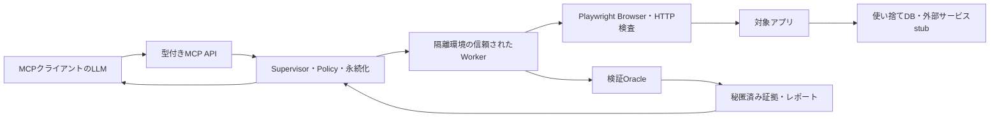
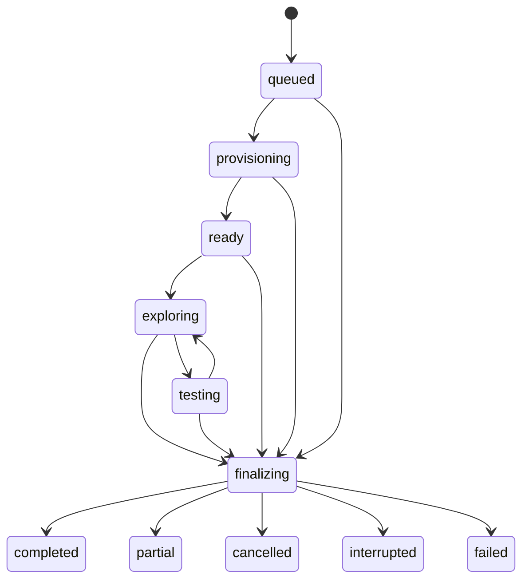

# Webサービス動的脆弱性検査 — 設計案

作成日: 2026-10-08
基準コミット: `5aec27513fe0f01e1b9232fa0a367d335e5d2148`
状態: 提案。ブラウザ検査・sandbox・LLM連携は未実装、実サービスへの攻撃は未実施。

## 1. 目的と初版の決定

リポジトリからWebサービスを使い捨ての検証環境に起動し、LLMがブラウザ操作・通信・関連コードを調べて攻撃仮説を立て、制御された検証で脆弱性候補を再現する。成果物は成立条件、期待動作、実際の動作、証拠、再実行手順、未検査範囲を含むJSON/Markdown。

初版の判断:

| 項目 | 決定 |
| --- | --- |
| LLM | MCPクライアントの既存LLMが探索・仮説作成を担当。サーバー内部からモデルAPIを呼ばない |
| 操作・判定 | MCPサーバーが型、対象、権限、上限を検査。独立した実行器とoracleが証拠を生成 |
| 対象 | 登録済みprofileで隔離起動したローカルsnapshotのみ。任意の公開URLを入力するモードは初版対象外 |
| 認証 | syntheticアカウントをactor別のBrowserContextに分離。パスワード・cookieをLLMへ渡さない |
| 初版検査 | 読取りの認可漏れ、反射/DOM XSS、契約がある業務ルール違反 |
| 状態変更 | fixtureの使い捨てDBだけに限定し、profileが許可した操作に限る |
| 未知の問題 | LLMはcatalog外の仮説も記録可能。決定的oracleがないものはcandidateのまま |
| 実装 | 既存の静的3ツールに動的9ツールを追加。ブラウザ依存はoptional workerへ分離 |

クライアントLLM方式なら、既存のMCP利用者が使うモデルをそのまま利用でき、モデルAPI鍵をMCPに追加する必要がない。一括自律実行用のサーバー内部LLM adapterは将来追加可能だが、同じ操作契約・policy・oracleを使う別phaseとする。

任意のWebサービスが設定なしで起動・検査できるという設計にはしない。初版の実装検証用reference profileは、固定Python runtime、固定argvで起動するfixture Webアプリを対象とする。業務リポジトリは個別profile登録後に対応する。

## 2. 既存実装との接続と前提修正

現実装の `scan_repository/get_scan/cancel_scan` はtracked working treeを静的に検査し、対象コードを実行しない。動的検査は対象の起動とfixture更新を伴う、独立したcapabilityである。

参照: [現在の仕様](specification.md)、[既存の設計](design-repository-vulnerability-report-mcp.md)。

動的検査を公開する前のP0 gate:

- 宣言outputSchemaと実際のreportの `revision/uncertainty/null`、cancel結果を整合させる。
- stateとJSON/Markdownを同じrevisionで永続化し、再起動時も一致させる。
- 新workerでは全体deadline、累計byte、プロセス終了、cache排他・ACLを実装して試験する。既存設定値の存在を実装済みの根拠にしない。
- 自己検査テストをHEAD有無・現在のindexに依存しないfixtureに直す。
- protocolVersion、tool定義、画像・structuredContentの相互運用を実際の対象MCPクライアントで検証する。

静的レポートは証拠の入口として利用するが、既存reportだけではsnapshot同一性を証明できない。動的jobにコピーしたtracked working treeのmanifest hashを持たせ、静的結果を結び付ける際は各source hashとの一致を検査する。

## 3. アーキテクチャと信頼境界

責任:

| コンポーネント | 責任と権限 |
| --- | --- |
| LLM client | 正常操作、仮説、次の型付き操作の選択。実行可否やconfirmed判定を変更できない |
| Supervisor | admission、server-owned profile解決、global budget、非同期処理、cancel、cleanup、audit記録 |
| Policy engine | capability、actor、origin、mutation、fixture effect、stale observationを毎回検証 |
| Runtime manager | snapshotコピー、image digest固定、隔離起動、reset、停止・残存確認 |
| Browser/HTTP worker | browser、認証、実通信、DOM観測。targetプロセスとidentity/FSを分離 |
| Oracle | 信頼されたfixture契約と観測値から、ケース結果を判定 |
| Evidence store | redact後のartifact、hash、世代pointer、append-onlyイベント、同世代レポート |

targetのsource、HTML、DOM、エラー、コメントは非信頼データ。ツール結果ではデータ領域として明示し、そこに含まれる指示を新しいpermission/profileとして解釈しない。LLMがその指示に従っても、サーバー側policyを迂回できない構造にする。ただしクライアントが持つ他のツールへのアクセスは本MCPの管理対象外。

## 4. 起動profileと隔離

profileは運用者がserver-owned領域へ登録する。targetのファイルをprofileとして自動採用しない。MCP入力は `profile_id` だけを選択し、shell、argv、image、外部URL、secret pathを受け取らない。

必須profile情報:

- 許可root、runtime adapter ID、digestで固定したimage、固定の起動/healthcheck/reset argv。
- fixture version、offline依存bundle、runtime設定のsynthetic値。
- actor一覧、login手順、credential handle、role/tenant、resource所有関係。
- 操作別capability、oracle契約、origin/service mapping、許可されたfixture effect。
- profile hash、環境構築上限、通常操作の期待結果、成功/拒否のoracle。
- source snapshotに必要なファイルの登録規則。実secretファイルはfixture設定で置換し、置換不能なら起動しない。

対象コードはホストで起動せず、rootをそのままwrite mountしない。tracked working treeから `.git`、実認証情報、不要な生成物を除外したコピーを作り、copy/filter一覧とhashを記録する。targetはscratchコピー内で起動・build可能だが、元リポジトリには書き込まない。除外により起動に必要な情報が不足した場合は `environment_unavailable` として終了する。

初版runtime adapterは専用Linux隔離環境のcontainer groupとする。WindowsからはLinux VM/WSL2上のengineに接続する想定で、利用可能性・Chromium起動・cleanupを実装前に確認する。ここではインストール済みとは仮定しない。

隔離要件:

- target、DB、stub、trusted browser workerを別container/identityに分離。targetにDocker socket、host filesystem、Supervisor鍵、LLM鍵をmountしない。
- non-root、capability削減、no-new-privileges、CPU/memory/process上限。Chromium sandboxを無効化するfallbackは使わず、起動不能なら失敗。
- group専用の閉じたnetworkとOS firewallで、component別に宛先IP/portを制限。host、metadata service、LAN、Internetへ出ない。
- browser/API workerは登録targetとtest sinkにのみ接続。アプリは登録DB/stubにのみ接続。proxy/DNS設定でhost外部へ迂回できない構成。
- 外部OAuth、メール、決済、CDNはfixture stubを使う。未対応の外部依存はcoverageに記録し、黙って実サービスへ接続しない。
- dependency downloadやrepository Dockerfileのホストbuildは行わない。登録済みoffline image/bundle不足は未対応として扱う。
- network遮断はPlaywrightのrouteだけに依存しない。redirect、popup、iframe、WebSocket、service workerを含めOS側で境界を強制する。

Dockerの `--network none` はloopbackだけのnetworkになるため、複数containerのアプリ/DB接続にはそのまま使わない。内部networkに加えhost gateway等の遮断を検証する設計上の判断。[Docker network none](https://docs.docker.com/engine/network/drivers/none/)

## 5. 認証、正常系、期待動作

actorは `anonymous/user_a/user_b/admin` 等のprofile登録ID。actorとrole/tenantの対応はfixture seed側の値を正とし、LLMがrole名を書き換えて権限を得られないようにする。

各actorに独立したBrowserContextとcredential vaultを用意する。cookie/local storage/session storageを他actorへ流用せず、各観測には実際に確認したidentityを付ける。認証失効時は `authentication_unavailable` として検査を止め、無認証の結果を低権限アカウントの結果として報告しない。

PlaywrightのBrowserContextはcookie等の状態分離に使えるが、DB状態・ネットワーク境界は別の仕組みで管理する。[Playwright isolation](https://playwright.dev/docs/browser-contexts)

開始後、trusted baseline procedureでlogin、ownerのresource読取り、正常なfixture操作を確認する。resource ID/所有者/unique markerはfixture registryから得る。存在しないresourceへの404や、正常系自体の故障を脆弱性再現として扱わない。

期待動作はprofileのpolicy matrix/業務契約に基づく。コードやLLMの推測しかない場合は `policy_unknown` としてcandidateを記録し、confirmedにはしない。

## 6. LLMができる操作

操作はdiscriminated union。全入力で追加propertyを拒否し、長さ・整数・enum・UUIDを検証する。具体的な構造は [設計用JSON Schema](plans/web-security-audit-contract.schema.json) を正とする。

| 操作kind | 許可範囲 |
| --- | --- |
| `observe` | actorの現在ページを観測し、bounded DOM/screenshot artifactとelement handleを発行 |
| `navigate` | 登録targetの相対pathへ移動。full URL、scheme-relative path、backslash、NULを拒否 |
| `click/fill/select` | 同じactor・最新observationに所属するserver-issued element handleのみ |
| `replay_request` | 捕捉済みrequest IDを別actorで再実行し、profileが許可したquery/JSON/header fieldだけを変更 |

mutation値はbounded文字列またはfixture resource handle。任意Cookie、Authorization、Host、proxy、接続先を直接指定する機能はない。actor切替ではworkerがそのactorの正規credentialを注入する。JSON pointer等のmutation先は捕捉時に発行したfield handleで表し、schemaのないbodyは初版で改変しない。

`fill` 等の後にページ遷移・DOM改訂が起きたら旧element handleを失効させる。URL判定はparse/normalize後のoriginとsandbox接続先を検証し、redirect全hopで再評価する。browser network観測はXHR/fetch等も記録するが、routeで捕捉できない通信の可能性を前提にOS境界と照合する。[Playwright network](https://playwright.dev/docs/network)

初版はservice workerをblockし、挙動差をcoverageに記載する。任意JavaScript評価、shell、Python、SQL、外部URL fetchをLLM操作として公開しない。XSS用の入力文字列は許可されるが、検証コードの注入・観測hookはtrusted catalogが所有する。

## 7. MCPツールの契約

動的tool群は `web_audit_enabled=true` のserver設定時だけ公開。通常の静的モードは従来の3ツール。動的jobは `audit_id` を持ち、静的 `scan_id` とnamespaceを分離する。

| ツール | 入力の主要項目 | 返却と効果 |
| --- | --- | --- |
| `start_web_audit` | root、profile_id、任意static_scan_id | admission後にaudit_idを返し、隔離環境を非同期準備 |
| `get_web_audit` | audit_id、任意cursor | 同世代summary、action/case状態、観測一覧、coverage、report artifact参照、次cursor |
| `web_action` | audit_id、expected_revision、client_action_id、action | durable receiptを返し、型付き操作を非同期実行 |
| `propose_web_case` | audit_id、expected_revision、case | hypothesis、oracle、stepsを保存し、case_idを返す。ここでは実行しない |
| `verify_web_case` | audit_id、expected_revision、case_id、client_action_id | fixtureをresetし、controlとattackを検証して結果を保存 |
| `get_web_source` | audit_id、source_ref | snapshot内のserver-issued参照から秘匿済みsource excerpt/hashを返す |
| `get_web_artifact` | audit_id、artifact_id、任意cursor | 秘匿済みartifactのbounded chunk表示。cache pathを入力できない |
| `finish_web_audit` | audit_id、expected_revision、reason | finalizingへ遷移し、未解決ケースとcoverageを確定してcleanup |
| `cancel_web_audit` | audit_id | 即時に取消要求を永続化し、worker停止・cleanupを開始 |

成功共通: `ok, audit_id, revision, state, operation, result`。operation別のresult型、case status、action statusをschemaで固定する。エラー共通: `ok=false, code, message, retryable, audit_id`。LLMの自然言語説明は型付きstatusを上書きしない。

`get_web_audit` はcursorなしなら最新世代、cursorありなら署名済みcursorに結び付いた固定世代を読む。pagination中に世代を混ぜず、mutating toolのCASには最新revisionが必要。reportは本文を丸ごと重複出力せず、JSON/Markdown artifact参照を返す。source/artifactはimmutable ID/hashで照合する。

JSON-RPCの最終serialize後にwire budgetを確認し、通常応答は128 KiB、artifact text chunkは64 KiB以内、画像添付はPNG 512 KiB以内とする。text contentとstructuredContentの重複・base64・escapingも含め全frameを2 MiB以内に収める。収まらない一覧はcursorで分割する。

隔離準備がsnapshotをsealしていない間、scopeのsnapshot hash/file countはnullとする。未取得値を空hashや0件の実測値として扱わない。

error code: `E_DISABLED/E_PROFILE/E_SCOPE/E_CAPABILITY/E_SCHEMA/E_REVISION/E_BUSY/E_AUTH/E_ENVIRONMENT/E_LIMIT/E_UNKNOWN_ACTION/E_NOT_FOUND/E_STORAGE/E_SUPERVISION`。未知kind/余分なfieldは実行前に `E_SCHEMA`。減らせない権限や増やせない上限はprofile側が所有する。

mutating toolはrevision compare-and-swapで予約する。job内の操作は直列1件、queueなし。pending操作中は `E_BUSY`。受理receiptは実行完了を意味せず、clientは `get_web_audit` でpollする。取消要求は別のdispatcher経路で受け付け、worker完了待ちのlockに巻き込まない。

### idempotencyと結果不明

`client_action_id` とcanonical input hashをdispatch前に保存する。同ID・同inputの再送には同じreceipt/resultを返し、二重実行しない。同ID・別inputは `E_SCHEMA`。成功応答が失われても元actionを新IDで勝手に再実行しない。

`prepared → dispatched → completed/failed` をjournalに記録する。`dispatched` 後にworker/通信が失われ、実行有無を確定できない場合は `outcome_unknown`。fixture書込みactionを自動再送せず、そのケースはinconclusive、jobはpartialとし、cleanup・reset後に別検証として扱う。

## 8. 仮説、ケース、oracle

caseは `category, hypothesis, actor_id, resource_ref, oracle_id, baseline_observation_ids, source_refs, steps, effects` を持つ。各stepは型付きactionで、最大20step。source evidenceは任意だが、成立したという判定にはruntime evidenceとtrusted policyが必要。

探索中のelement/request handleはfresh fixtureでは再利用できない。ケースstepはserver-issuedの安定した `control_ref/template_ref` とsymbolicなfixture resource refにcompileする。各replayで新しいDOMへcontrolを一意に再bindし、resource ID・CSRF token・actor credentialを新fixtureから解決する。対応を作れない場合はinconclusiveとし、古いselectorやtokenで成功したことにしない。

case result: `candidate/confirmed/rejected/inconclusive/skipped`。severityとconfidenceを分離し、HTTP 200、エラーメッセージ、LLMの確信度だけではconfirmedにしない。

| 検査 | oracle契約 |
| --- | --- |
| 認可漏れ・IDOR | ownerでresource markerを正常取得できるcontrol、異なるactor identity、deny契約、同じmarkerの不正取得を確認 |
| 反射/DOM XSS | 入力をdataとして扱う契約、catalog生成の無害なnonce marker、実ブラウザでの実行event、escape済みcontrolとの差を確認 |
| 業務ルール違反 | profile登録の価格/回数/状態遷移等のinvariantと、実際のfixture DB/response結果の不一致を確認 |

IDORでは他のテストユーザーが所有するresourceを使う方法が基準となる。[OWASP IDOR](https://wstg.owasp.org/v4.2/4-Web_Application_Security_Testing/05-Authorization_Testing/04-Testing_for_Insecure_Direct_Object_References/)

業務ルールではGUIだけでなく捕捉した通信のfield変更とserver側の結果を検査するが、何を許可すべきかは業務契約で与える。[OWASP integrity checks](https://wstg.owasp.org/v4.2/4-Web_Application_Security_Testing/10-Business_Logic_Testing/03-Test_Integrity_Checks/)

confirmedにはfresh fixtureでcontrolを含む2回の独立再実行が必要。2回一致しても安全性や網羅性を保証しない。reset不能、期待権限不明、login失敗、observer不調、片方しか再現しない場合はinconclusive/candidateを残す。

XSS確認では外部送信・cookie取得・永続的な破壊を行わず、sandbox内のmarker eventのみ使う。stored XSS、CSRF、SQL injection、SSRF、upload、race、大規模fuzzingは追加catalog phase。CSRF追加時はブラウザ本来のSameSite/CORS/CSRF tokenを保持し、同originの直接POSTをCSRF証拠にしない。SSRFの宛先はsandbox内sinkに限定する。

catalog外の仮説はLLMのsource/runtime reasoningと参照を保存できるが、任意コードoracleをアップロードしてconfirmedにする機能は提供しない。

呼出し例は [JSON examples](plans/web-security-audit-examples.json) に示す。`tool/arguments` はschema検証用envelopeで、実MCP呼出しではtool名とargumentsに分ける。公開時のinputSchema/outputSchemaには関連する`$defs`を展開または内包し、参照切れを作らない。

## 9. 状態機械、予算、終了

途中のexception、timeout、cancel、restartは `finalizing` に入り、終了理由を固定してcleanupする。終端はimmutable。provisioning失敗で動的証拠が得られなければfailed、探索途中の上限・不明結果・未検査ならpartial、取消後に残存停止を確認した場合はcancelled、再起動で旧実行を止めた場合はinterrupted。

completedの条件は、少なくとも1つのeligible caseとbaselineを実行し、選択したplan内のケースがconfirmed/rejectedとして確定し、未解決actionがなく、証拠保存とcleanupが成功したこと。問題なしという全体判定は返さず、検査範囲内の観測として記録する。

| budget | 初版のserver上限 |
| --- | --- |
| active job / action queue | 1 / 0 |
| provisioning / job wall time | 180秒 / admissionから20分 |
| action / verification case | 15秒 / 120秒（2回のreplayを含む） |
| client待ちidle | 180秒 |
| browser操作 / HTTP requests | 200 / control・replay・subresourceを含む計1,000 |
| 同時HTTP / target送信rate | 2 / job全体5 requests毎秒、burst 5 |
| response / 累計読取りbyte | 1 MiB / 50 MiB、stream中に停止 |
| actor / page / case / step | 4 / context毎2 / 30 / case毎20 |
| source excerpt | 1回16 KiB / job計1 MiB |
| DOM / screenshot | 1回32 KiB / 1枚512 KiB・最大20枚 |
| artifact合計 / report | 100 MiB / JSON 2 MiB・Markdown 1.5 MiB |
| worker container group | 合計CPU 2 cores・memory 4 GiB・process 256 |
| cancel検知 / cleanup | 1秒 / 10秒、超過時に強制停止・残存確認 |

monotonic deadlineとglobal countersはSupervisorが所有し、worker任せにしない。確認・redirect・resetの通信もbudgetから差し引く。job終了やtimeout後のpending通信は新規dispatchせず、全workerを停止する。

client-driven LLMのtoken/API料金はMCPから強制制御できない。client側に別のtoken/cost上限を設定し、MCPのbudgetは実際に観測したtool/worker活動だけを数える。申告されたtoken数を実測値として扱わない。

## 10. cleanup、復旧、保存

各jobはserver-owned storageの `web-audits/<audit_id>/` に保存し、既存static recordsと分離する。保存にはprofile hash、snapshot manifest、actor metadata、limits、action/case journal、artifact manifest、同世代state/report、audit HMACを含む。

network切断 → browser/API worker停止 → target/DB/stub停止 → fixture volume回収/削除 → runtime残存一覧確認の順で終了する。原リポジトリ、他job、ユーザーのcontainerは削除しない。resource IDとaudit labelが一致するものだけを扱う。

cleanup失敗時はfailed/`cleanup_failed`。該当sandboxをquarantineし、新しいjobのadmissionを停止して `E_SUPERVISION` を返す。cleanupが未確認のままcancelled/completedとしない。監視不能状態を解消する運用手順はresource manifestに基づく。

起動時は非終端jobをjournalから復旧し、runtime labelで残存を確認・停止する。攻撃actionは再開せず、結果不明を明記してinterrupted/failedレポートを再生成する。既存レポートをそのまま流用してstate/revisionがずれる方式は使わない。

cacheはcurrent-user限定ACL、プロセス間排他、100終端jobまたは7日のretention。active/quarantineは自動削除対象外。raw browser trace/HARはcookie、POST body、storageを含み得るため、初版でそのまま保存・公開しない。認証状態はworkerの一時vaultだけに保持しcleanupで破棄する。[Playwright authentication](https://playwright.dev/docs/auth)

## 11. 証拠とレポート

runtime findingには次を必須とする:

- finding ID、category、status、severity、oracle ID/version、profile/policy hash。
- snapshot hash、actor/role/tenantの非secret識別子、fixture version。
- baseline、control、attack、repeatのobservation/artifact IDとhash。
- 期待結果、実結果、成立条件、source refs、再実行steps、未確認条件。
- 実行日時、budget終了理由、cleanup確認、scope違反の記録。

artifactはtrusted workerの観測から作り、LLMから証拠bodyを受け取って観測事実として採用しない。response、DOM、source、headersをredactしてから永続化し、そのbyte列をhashする。screenshotはfixtureのsynthetic画面のみを許可し、認証画面・credential fieldを撮影対象から外す。未知の実データを含む画像の完全な秘匿を保証しない。

LLMへは秘匿済みDOM、通信要約、source excerptを基本とし、画像はprofileで許可されたartifact要求時だけ渡す。モデルに渡る内容もjob artifact manifestに記録する。

`report_version=2` のdynamic sectionに `scope, runtime, coverage, cases, findings, uncertainties, limits, cleanup` を設ける。静的findingとの関連は明示的なsource hash/refで付け、静的候補だけからruntime confirmedへ昇格しない。JSONを唯一のcanonical dataとし、MarkdownとMCP出力は同世代JSONから生成する。

case count、eligible/未検査範囲、外部依存、認証失敗、未対応rule、budget停止をcoverageに表示する。sourceなしのblack-box confirmedと、sourceで原因位置まで特定したconfirmedを区別する。

## 12. 具体例: 他ユーザーの注文の読取り

profile登録の契約: `user_a` は `order_b` を読めず、所有者 `user_b` は読める。fixtureは注文に毎回異なるsynthetic markerを付ける。

1. `start_web_audit` の準備完了後、user_bのBrowserContextで注文を表示し、owner controlとrequest handleを保存。
2. LLMが関連source/refと観測を読み、認可漏れのcaseを `propose_web_case` へ提出。
3. trusted verifierがfresh fixtureでuser_bの正常系、user_aのlogin identity、user_aによる同resource requestを確認。
4. deny契約に反してorder_bのmarkerを読めた場合、別fresh fixtureで同じcontrol/attackを再実行。
5. 両回のidentity・ownership・marker・通信が一致した場合だけconfirmed。それ以外はrejectedまたはinconclusive。
6. reportにactor、resource ref、oracle、再現steps、秘匿した通信、source関連、cleanupを記録。

この確認はテスト用アカウント・データだけで完結し、実ユーザーのデータ取得は検査要件にしない。

## 13. モジュールと実装順

追加想定: `src/repository_vulnerability_report_mcp/web_audit/`。

| module | 責任 |
| --- | --- |
| `profiles.py / policy.py` | 登録profileとcapability、origin/actor/field判定 |
| `contracts.py / state.py` | strict schema、FSM、revision、action idempotency |
| `supervisor.py / runtime.py` | budget、非同期dispatch、sandbox起動/reset/停止 |
| `browser.py / http_probe.py` | 型付き操作、identity、network観測 |
| `cases.py / oracles.py` | hypothesis記録、control・2回replay・判定 |
| `evidence.py / store.py / report.py` | redact、immutable artifact、audit、世代保存 |

Playwright/Chromium/runtime driverはoptional worker環境の固定lock/imageで管理し、静的モードにブラウザinstallを要求しない。

実装順とexit gate:

1. **P0修正**: 現在のschema/state/report/自己検査の整合、全既存テスト成功。
2. **Runtime spike**: Windows側からreference profile起動、network境界試験、Chromium sandbox、強制停止・cleanupを実測。使用image/runtime pinを確定。
3. **契約・永続化**: schema、FSM、CAS、idempotency、restart。操作未実装でもunknown outcomeを正しく復旧。
4. **Browser探索**: actor分離、login、DOM handle、相対navigate、通信捕捉、秘匿。
5. **HTTP replay・oracle**: field handle、IDOR/XSS/業務fixture、fresh control/repeat。
6. **LLM利用手順**: クライアントへtool contractとpolicyを提示し、fixture上で仮説→検証→終了を実行。
7. **統合・運用**: 同世代report、cancel、retention、実repository reference profile登録。
8. **拡張**: stored XSS/CSRF等、またはserver-side LLM adapter。初版と同じboundary/evidence gateを適用。

## 14. 受入条件

| 試験 | 必須結果 |
| --- | --- |
| 脆弱/修正済みのpaired IDOR fixture | vulnerableだけconfirmed、patchedはrejected。owner controlとactor identityを保存 |
| 脆弱/修正済みのpaired XSS fixture | nonce実行の有無とcontrolで判定。文字列反射だけではconfirmedにならない |
| 契約あり/なしの業務fixture | invariant違反のみconfirmed、契約不明はcandidate |
| session/role/tenant分離 | Cookie混在やlogin失効を検出し、誤ったactorのfindingを作らない |
| redirect/DNS/popup/iframe/WS/worker経由の外部接続 | host・metadata・LAN・Internetに実通信が到達しないことを別観測で確認 |
| targetの悪意あるコード・HTML指示 | profile/argv/宛先/権限を拡張できず、Supervisor証拠を改ざんできない |
| 余分なfield・未知kind・古いhandle/revision | dispatch前に拒否、ネットワーク・DB副作用ゼロ |
| duplicate action・応答消失・worker crash | 同IDで再実行ゼロ、結果不明の書込みを自動再送しない |
| byte/time/request/process上限 | streaming途中でも停止し、実測counterとpartial理由を保存 |
| cancel/restart/cleanup失敗 | orphanを検出、cleanup未確認ならcompleted/cancelledにしない |
| trace/credential/privacy | 永続artifact・MCP出力・LLM送信内容に実credentialがない |
| report/schema | 全ツールinput/output、state/report revision、artifact hashが一致 |
| 原リポジトリ保護 | tracked/untrackedファイルの前後hashとGit indexが一致 |
| live MCP fixture | 実stdio clientと実browserで一連の操作を再現。mock-onlyの成功で完了としない |

依存環境がない場合はskipped/failed理由を保存し、試験成功として数えない。設計書やschemaの形式検査だけでは、この受入条件の達成を宣言しない。

## 15. 残る判断

- runtime adapterのWindows実機互換性とimage digest: Runtime spikeで決定。
- 実業務repositoryの起動/reset profile、role/resource契約: プロジェクトごとの設定が必要。
- ブラウザsnapshotの秘匿精度、非英語DOM、SPAでのhandle安定性: paired fixtureで評価。
- LLMモデルごとの検出率・誤検知率・費用: クライアント側の実測比較が必要、現時点で保証しない。
- 高信頼の敵対的target実行には専用VM等の追加境界を選択可能にする。container/BrowserContextだけで任意のhost攻撃を完全に防ぐ保証はしない。

## 16. この設計作業で確認した範囲

- 設計用JSONと呼出し例をparseし、9ツールの定義、全local `$ref`、pattern構文、必須propertyの存在を確認。
- このschemaで使用する構造制約のcheckerで、正例7件を受理し、不正例11件を拒否。余分なcommand、未知action、古い探索handleの混入、0 revision、外部URL、scheme-relative URL、backslash/NUL、step超過、クライアントのconfirmed申告、不明statusを含む。
- checkerは使用keywordの部分集合を検査したもので、Draft 2020-12全体のmetaschema検証ではない。完全validatorと実MCP clientによる検証は実装phaseのgateとして残す。
- 相対リンク、UTF-8、空白、fence、Git HEAD/index・追跡コードの不変を確認。
- runtime起動、実ブラウザ通信、LLM攻撃、ネットワーク隔離、脆弱性検出率のlive検証は未実施。既存のテスト失敗の修正も今回の範囲外。

## 17. 実装状況（2026-10-08）

初版のブラウザ検査を実装した。実際の起動手順、実装した判定基準、リソース上限、設計との差分、検証方法は [Web検査の実装ガイド](web-security-audit.md) を参照する。

第16節は設計時点の記録。現在はDocker/Chromiumとstdio MCPによる合成アプリ3分類の脆弱版・修正版比較、登録Gitプロジェクト、強制終了後の復旧を検証対象にした。P0として静的検査の状態とレポートの整合、累計byte、別プロセスAST timeout、既存自己検査のGit状態依存も修正した。

初版で未実装の項目を設計全体の完了と扱わない。主な差分はcleanup期限30秒、pids合計384、単一request oracle、一覧cursorの古いrevision拒否。静的scanとのsnapshot連結、保存型XSS/CSRF、スクリーンショット、原因行特定、LLM検出率の評価は未対応。
